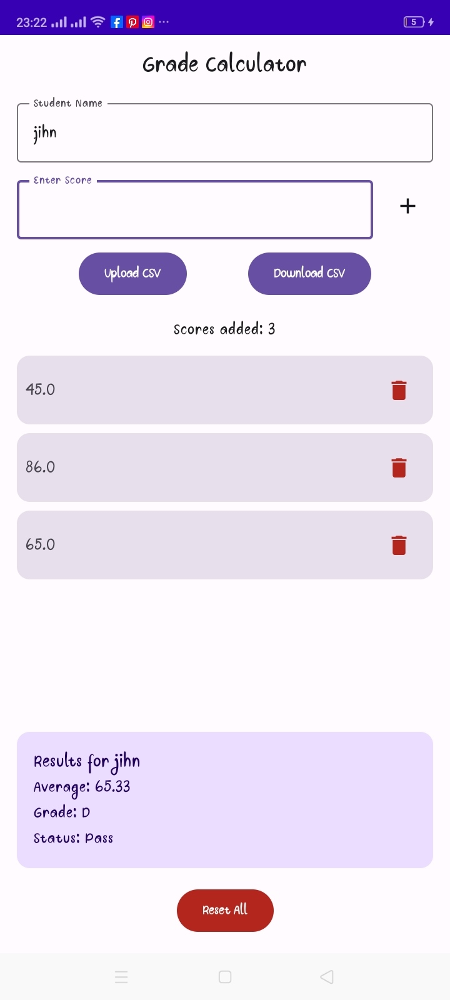
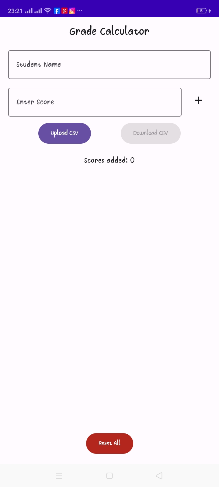
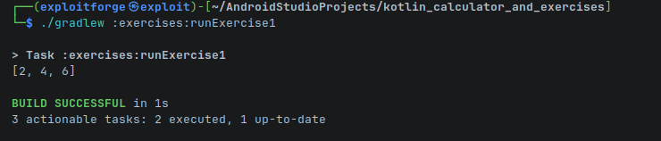
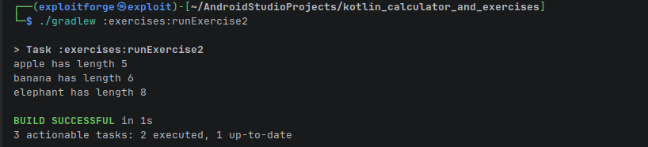
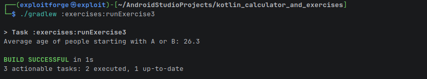

# Kotlin Learning Projects

A collection of Kotlin-based projects, including an Android Calculator app and a set of programming exercises.

## UI Preview




## Project Structure

- **`kotlin_calculator/app`**: An Android application that functions as a calculator/grade calculator.
- **`exercises/`**: A Kotlin JVM module containing various programming exercises.

## Prerequisites

- Android Studio or IntelliJ IDEA
- JDK 17 or higher
- Android SDK (for the calculator app)

## How to Run

### 1. Android Calculator App
To build the debug APK:
```bash
./gradlew :app:assembleDebug
```
The APK will be generated at:
`kotlin_calculator/app/build/outputs/apk/debug/app-debug.apk`

To install it on a connected device:
```bash
./gradlew :app:installDebug
```

### 2. Kotlin Exercises
You can run the individual exercises using the following Gradle tasks.

- **Exercise 1:**
  
  ```bash
  ./gradlew :exercises:runExercise1
  ```
- **Exercise 2:**
  
  ```bash
  ./gradlew :exercises:runExercise2
  ```
- **Exercise 3:**
  
  ```bash
  ./gradlew :exercises:runExercise3
  ```

## Configuration

This project uses **AndroidX**. Ensure your `gradle.properties` includes:
```properties
android.useAndroidX=true
android.enableJetifier=true
```
