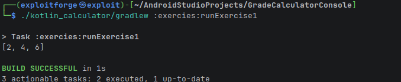
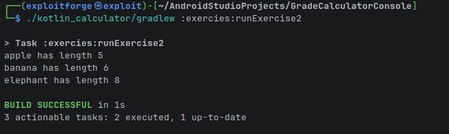
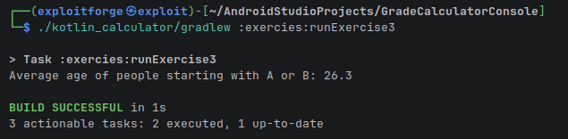

# Kotlin Exercises

This directory contains a set of Kotlin exercises to practice fundamental concepts like collections, lambdas, and data classes.

## Exercises

### Exercise 1: List Processing
- **File:** `Exercise1.kt`
- **Description:** Demonstrates filtering a list of integers using a predicate function.
- **Run Command:**
  ```bash
  ./kotlin_calculator/gradlew :exercies:runExercise1
  ```
- **Execution:**
  

### Exercise 2: Map and Collection Operations
- **File:** `Exercise2.kt`
- **Description:** Shows how to associate strings with their lengths in a Map and filter the results.
- **Run Command:**
  ```bash
  ./kotlin_calculator/gradlew :exercies:runExercise2
  ```
- **Execution:**
  

### Exercise 3: Data Classes and Aggregation
- **File:** `Exercise3.kt`
- **Description:** Uses a `Person` data class to filter a list by name and calculate the average age of the filtered group.
- **Run Command:**
  ```bash
  ./kotlin_calculator/gradlew :exercies:runExercise3
  ```
- **Execution:**
  

---

## How to Run
All commands should be executed from the root of the project (`GradeCalculatorConsole`).

If you encounter a "permission denied" error for `gradlew`, run:
```bash
chmod +x kotlin_calculator/gradlew
```
